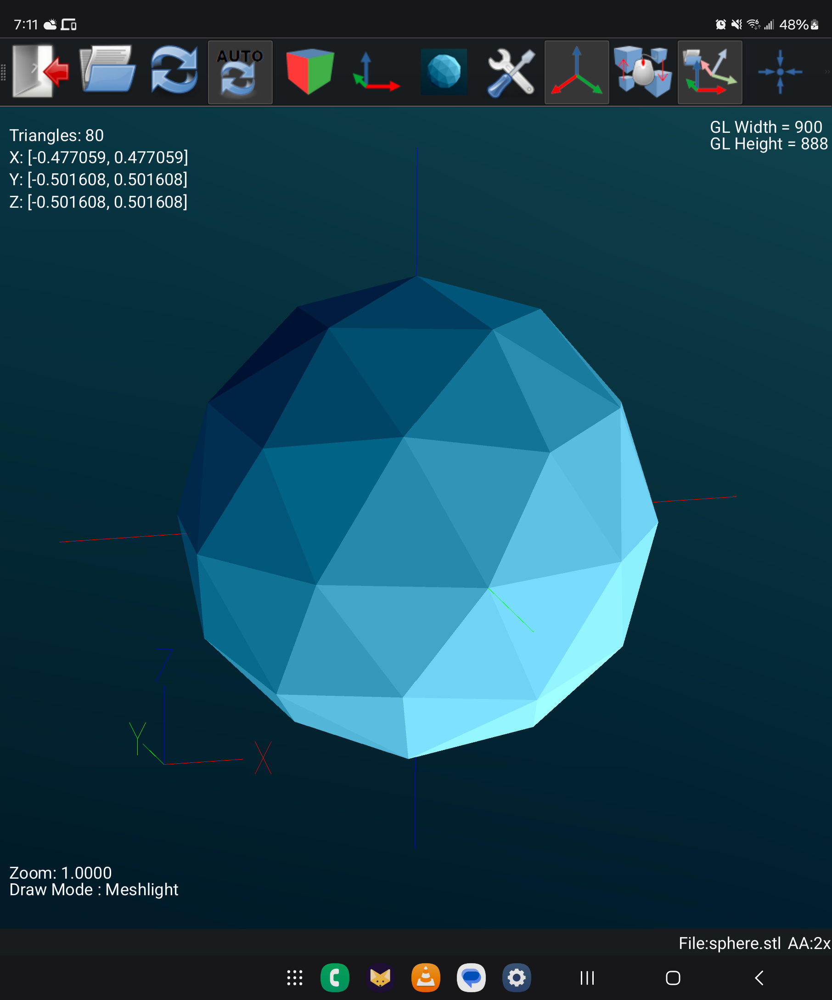

# fstl-e for Android

<p align="center"></p>

Android port of [fstl-e](https://github.com/wdaniau/fstl), a viewer for STL, 3MF and STEP models. The current candidate is a testing prerelease; production readiness remains under review.

## Download and testing

**[Download the Android APK (arm64)](https://github.com/Prj-m/fstl-e-android/releases/download/v1.0.4-rc.2/fstl-e-1.0.4-rc.2-arm64-dev.apk)** · [SHA-256 checksum](https://github.com/Prj-m/fstl-e-android/releases/download/v1.0.4-rc.2/SHA256SUMS)

The [1.0.4-rc.2 testing release](https://github.com/Prj-m/fstl-e-android/releases/tag/v1.0.4-rc.2) includes an arm64 development APK and a SHA-256 checksum. Verify the checksum before installation. The debug-signed APK uses `com.github.prjm.fstl_e.dev`, installs alongside the Play app, and is intended for evaluation.

Report reproducible issues with nonconfidential models through [GitHub Issues](https://github.com/Prj-m/fstl-e-android/issues). Include app version, Android version, device model, steps and expected versus actual behavior. Keep credentials, device serials, private models and unrelated logs out of reports.

## Source and development status

The default branch does not yet contain the candidate's Android import hardening and release-validation workflows. Those changes are under review in [PR #2](https://github.com/Prj-m/fstl-e-android/pull/2) on `codex/android-release-readiness`. Use that branch to reproduce the candidate build:

```bash
git clone https://github.com/Prj-m/fstl-e-android.git
cd fstl-e-android
git switch codex/android-release-readiness
```

The reviewed build uses Qt 6.11.3, JDK 17, SDK API 36, NDK 27.2.12479018 and OCCT 7.9.3. Dependencies are built or installed separately; their binaries are not tracked in Git. After checking out the review branch, follow its build and validation instructions:

- [CI/CD and local builds](https://github.com/Prj-m/fstl-e-android/blob/codex/android-release-readiness/docs/CI_CD.md).

Compatibility across Android versions and native 16 KB devices is still being tested.

## License and credits

Application source is covered by the [MIT license](LICENSE). STEP support uses OCCT under LGPL 2.1 with the Open CASCADE exception. Qt and other dependencies have their own licenses.

- Original fstl: [Matt Keeter](https://github.com/fstl-app/fstl).
- fstl-e enhancements: [William Daniau](https://github.com/wdaniau/fstl).
- Android port: Prj-m and contributors.
